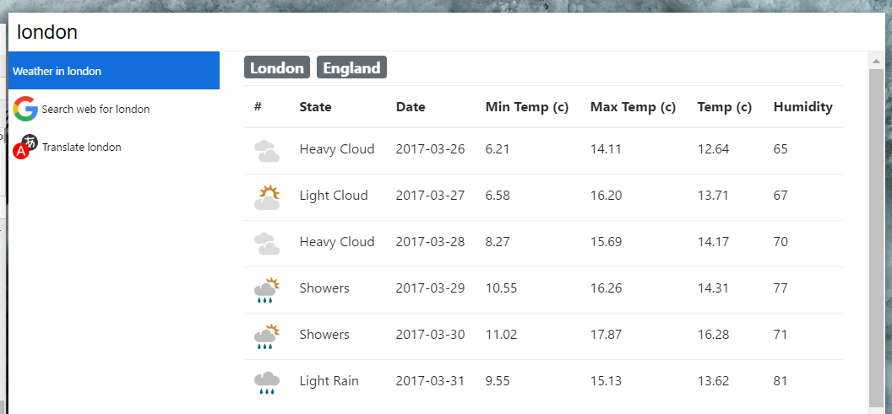

# Cerebro Weather

> Cerebro plugin to show a five-day weather forecast

## Usage
In Cerebro, type a search query. The first matching city's weather will be shown.

## Related
* [Cerebro](http://github.com/KELiON/cerebro) – main repo for Cerebro app
* [cerebro plugin boilerplate](https://github.com/KELiON/cerebro-plugin) – boilerplate used to create this plugin

## License

MIT © Ezinwa Okpoechi
